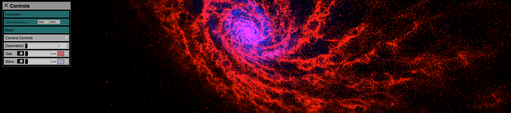

# Firefly



Firefly is an interactive particle viewer designed for [FIRE](http://galaxies.northwestern.edu/fire-simulations/) data, written in WebGL using the three.js library. A live version is available [here](https://ageller.github.io/Firefly/).


## Installation

To install Firefly (on any operating system), please clone this GitHub repository :
```
> git clone https://github.com/ageller/Firefly.git
```

Or, if you prefer, you can download the zip file and unpack it.  

You will also require a browser; we recommend Firefox or Google Chrome. To import your own data into Firefly, you will also require python; we recommend installing [Anaconda](https://www.anaconda.com/download/) Python version 3.x .

## Running Firefly

To start Firefly, you can simply open the index.html file with your browser.  We recommend Firefox or Chrome.  If you prefer Chrome, you may need to host your own server.  This is easy to do by executing the following python command within the directory that contains your index.html file:

```
> python -m SimpleHTTPServer
```

Once this SimpleHTTPServer is running, you can open Chrome, and enter the url : http://localhost:8000/ .  (This python step should not be necessary with Firefox, but may be necessary with other browsers.)

This will open the data set included within this repository.  If you want to use your own data, you will first need to convert your data to the format needed by Firefly.  You can do this with the python tools in the data directory.  Please see the [wiki page](https://github.com/ageller/Firefly/wiki/Documentation) for more details.  

Note: For very large amounts of data, you may need to increase the memory allowed in your Chrome browser.  To do so, you can launch Chrome from the command line as (and change the numerical size value to something appropriate to your needs) :

```
> /Applications/Google\ Chrome.app/Contents/MacOS/./Google\ Chrome --args --js-flags="--max_old_space_size=8192"
```

## Additional Docs

Additional documentation is available on the [wiki page](https://github.com/ageller/Firefly/wiki/Documentation) associated with this repository.

This tool builds off of a [previous version developed by Alessandro Febretti](https://github.com/nuitrcs/firefly). 

