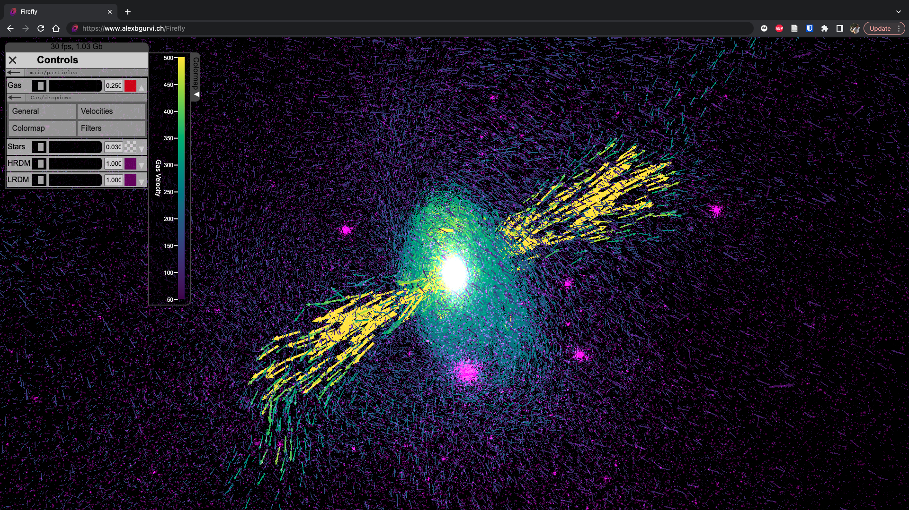

.. Firefly documentation master file, created by
   sphinx-quickstart on Thu Jun 24 09:37:39 2021.
   You can adapt this file completely to your liking, but it should at least
   contain the root `toctree` directive.

Firefly: a browser-based interactive particle data visualization platform
=========================================================================

Firefly is an interactive application for visualizing particle-based data 
from within the web browser.
Through Firefly users can interact with existing Firefly visualizations as well as create their own.

Firefly can be run from entirely within a Jupyter notebook using the
Python frontend.

Contents
--------

.. toctree::
    :maxdepth: 1

    installation
    webapp/index
    data_reader/index
    server
    experimental
    reference/api/api
