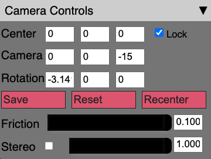

Camera controls
===============

Upon startup this sub-panel will be collapsed.
Click on the downward facing arrow on the right side to expand
the sub-panel, as shown in the image above.
Within the Camera Controls, you will see the current values
of the Center, Camera and Rotation. 

These are updated as you change the view
(with your mouse or keyboard; see above).

.. note:: 
	You cannot edit these fields directly even though they appear 
	as text input boxes. They are only for reference, i.e. if you
	want to use a different program to render your data from the same
	perspective.

.. _lock button:

Lock
----
Next to the Center text boxes, you will see a checkbox labelled "Lock".
This will allow you to switch between Trackball and Fly controls. 

Save/Reset/Recenter
-------------------

Below the text boxes you will see three buttons. 

"Save" allows you to mark the current location,
which you can return to if you click the "Reset" button. 
"Recenter" resets only the center back to the initial value
(or the previous save, if clicked).

Friction 
-------- 

Below those buttons, is the "Friction" slider and text entry box. 
For Trackball mode, this controls the rate that the camera stops moving after you release the mouse. 
For Fly mode this controls the speed that you move around while pressing the keyboard control buttons.

Stereo
------
Finally, there is a "Stereo" checkbox, slider and text entry box.
If you click the checkbox, the renderer changes to stereoscopic side-by-side mode.  The slider and text entry box controls the separation between the cameras in the stereoscopic mode. 
This can be used with a 3D display and glasses that can overlay
the two images to produce a 3D image.

The slider adjusts the image separation to adjust eye distance for the 3D
effect.

.. seealso:: 

	There is experimental support for VR using the stereoscopic mode,
	see :ref:`experimental features`.
