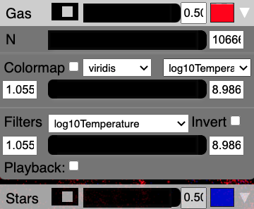

Particle controls
=================

Upon startup this sub-panel will be collapsed.
Click on the downward facing arrow on the right side to expand
the sub-panel, as shown in the image above.

Collapsed view
--------------

Each particle type will receive it own sub-panel. 
In the example above, we show two different particle types:
Gas and Stars. 
Initially these sub-panels will be collapsed (as shown for Stars above). 

Within this collapsed view, from left to right, you
have a switch to turn the particles on or off, a slider and text box to
change the particle size, and a colored box to change
the change the particle's color.

If you click on the downward facing triangle on
the right side of the sub-panel,
you can expand the sub-panel to review additional controls
(as shown for Gas above).

N
---

The first item in the expanded sub-panel is a slider and text entry box
for "N", which controls the number of particles that will be drawn.
(The default is to draw all, and you can slide this to
lower values to draw less).
This is analogous to the global Decimation slider,
but works on each particle separately.

Plot Velocities
---------------
If you provide velocities to Firefly,
there will be a checkbox to "Plot Velocity Vectors." 
If you click the checkbox, the points will be converted to lines
(by default), where the forward direction is whiter,
and the backward direction becomes more transparent. 
You may need to increase the particle size to see the vectors. 

You can also change the velocity vector plotting style to be one of 

1. lines
2. triangles
3. arrows

using the dropdown menu (the pointed side of the triangles or arrows point in the
direction of the velocity vector).

.. seealso::
	
	:code:`"Velocities"` is a special field name, see :ref:`field names`.

Colormap
--------

If you choose to define fields in your data that are colormappable then
there will be a Colormap section containing a checkbox, two dropdowns, 
and a **two-handled** slider bar with text input boxes. 

If the Colormap checkbox is checked then particles in that group will take
colors defined by applying a colormap to the currently selected field value.
A draggable colorbar will also appear.
The two dropdown boxes let you change the colormap and currently selected field. 

The slider bar and text entry boxes change the colormap limits. 
Particles with field values below the bottom slider handle position will 
take the bottom color of the colormap. 
Analogously, particles with field values above the top slider handle position
will take the top color of the colormap.
If you enter text in the text boxes, the colormap slider limits will be redefined
for fine adjustment using the slider between the new limits.

.. note:: 

	It is not currently possible to use a custom colormap but the
	enterprising user could consider replacing the corresponding 
	row in the texture map located at:
	:code:`Firefly/src/firefly/static/textures/colormap.png`. 
	The name in the UI can't be changed but you'll be able to colormap 
	your data nonetheless.

Filters
-------

If you choose to define Filters when creating your data (see :ref:`api`),
you will also see a dropdown, slider **with two handles**, two text entry boxes. 
each of the filters you indicated, and an "Invert" checkbox.

These filters define what data should be drawn on the screen. 

The two-handled slider and text entry boxes define the limits of
the filters. 
Only particles that have parameters within the black region of the slider will be drawn. 
If you enter text in the text boxes, the filter slider limits will be redefined
for fine adjustment using the slider between the new limits.
Only particles with field values within the black region of the slider
will be drawn.
If the "Invert" checkbox is checked, instead
only the particles that fall outside the black bar's extent are shown.

The dropdown menu allows you to choose between different fields to 
filter on. 
Filters are applied additively, so you can layer different filters
together.

There is also a playback checkbox which will slide the black bar
along the filter limits and update the view accordingly.
Currently it is not possible for the user to redefine the
playback speed (but you can change the size of the black bar)
and it is discouraged from layering different playbacks
(it *probably* works but it might also break something).
